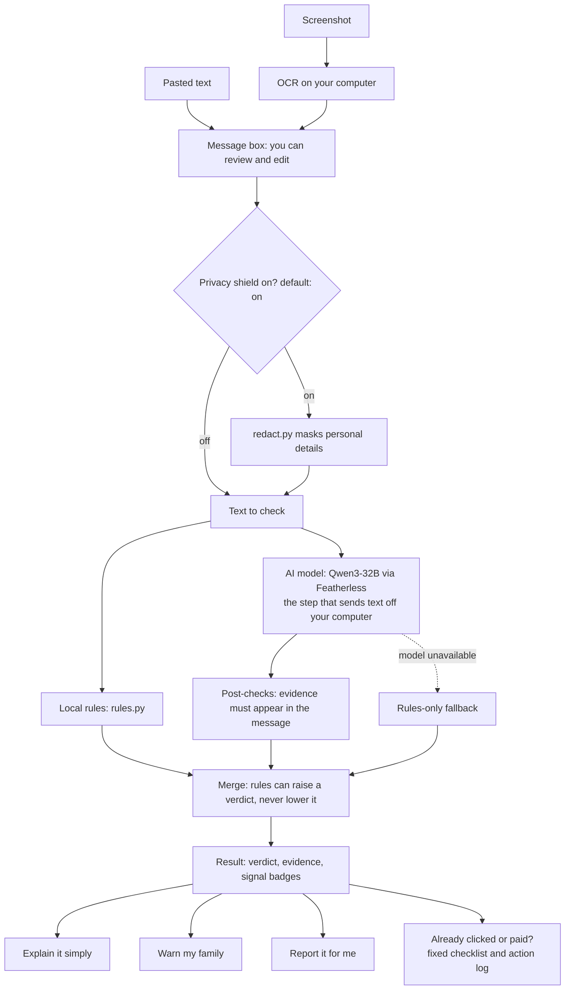

# Second Look

A scam-message checker for older people and the family who look out for them. Built for ForgeHacks 2026, AI + Cybersecurity track (helping people recognise, verify and respond to scams, impersonation and fraud).

You paste a suspicious message or upload a screenshot. Second Look gives a plain-language verdict with the evidence highlighted, tells you what to do next, and helps you warn family or report it. Personal details are masked on your own computer before anything is sent to the AI model.

## Who it is for

People who get a text, email or WhatsApp message and are not sure whether it is genuine, and the relatives who get asked "is this a scam?". It uses large, readable text, plain wording and a calm tone.

## Features

**Check a message.** Local rule checks (bare domains, link shorteners, lookalike domains of known brands, urgency and payment wording) run alongside an AI model (Qwen3-32B served by Featherless). The result is a verdict, a risk score, the exact phrases in the message that raised concern (highlighted), and signal badges. A phrase is only shown as evidence if it really appears in the message.

**Screenshot upload.** The text in a screenshot is read on your computer with an OCR library and placed in the message box, where you can review and edit it. It is then treated like pasted text, including masking. The app does not save the image. Screenshot input was not part of the accuracy testing. If the OCR library is not installed, the app still runs and you can paste text instead.

**Privacy shield.** On by default. Before anything is sent to the model, it masks email addresses, phone numbers (UK and US), card numbers (Luhn-valid), sort code and account numbers, IBANs, US Social Security and UK National Insurance numbers, one-time codes near keywords, and emails, phone numbers and codes inside link query strings. It runs locally.

**Explain it simply and large-text mode.** Rewrites the verdict in plain language. The output is checked (no links, no advice to delete) and replaced with fixed wording if it fails. A large-text and large-buttons switch is available.

**Warn my family.** Drafts a short message you can forward to relatives. The draft is checked (no links, no digits, no domains) and falls back to a fixed template per scam type if it fails.

**Report it for me.** Builds a report from a local template with an optional AI summary. The sender, link and message text never reach the model. Report channels for the UK and US are listed by type (text, email, fraud). The report downloads as a .txt file.

**Smart handoff.** After a check, suggests the most relevant next page. The scenario choice is deterministic, and the AI only picks action IDs from a fixed whitelist. Its input is capped and masked first.

**Already clicked or paid?** A fixed checklist of steps by situation. No AI model is used. You can download an action log containing the country, the actions you ticked and the checklist status. It contains no message text, sender or link.

**Is it really them?** A fixed guide for checking whether a caller or sender is genuine, including safe-word advice and a note that caller ID can be faked. No AI model is used.

**Link inspector.** Breaks a link into its parts and flags deceptive subdomains, lookalike domains and unusual endings. It analyses the text of the link only and never opens it.

**Spot the Scam quiz.** Fixed training scenarios at three levels, with instant explanations. Training only; it does not use the model.

**How accurate is it?** Shows the measured results below, with caveats.

**About and privacy.** Fixed text describing what leaves your computer and what the app stores.

**Themes.** 13 colour themes (Rose Pine is the default). Automated tests check that button and pill text meets a 4.5:1 contrast ratio and that checkbox, radio and progress fills meet 3:1 against the page background. This is not a full accessibility audit of every screen.

## Design principle

- AI helps understand and draft. Fixed, checked content gives safety-critical advice.
- Every AI output is post-checked, with a fixed fallback if it fails.
- Rules can raise a verdict (for example from "likely safe" to "suspicious") but never lower it.
- Text from the message is treated as untrusted input throughout.

## Architecture



## Measured results

Measured on a second set of 50 fictional messages written by an AI (22 scams, 28 legitimate) that the prompt was never tuned on.

| Configuration | Accuracy | Precision | Recall | F1 | Errors |
|---|---|---|---|---|---|
| Rules only | 58% | 100% | 5% | 0.09 | 0 |
| Model only | 94% | 95% | 90% | 0.92 | 3 |
| Full app (rules + model) | 92% | 95% | 86% | 0.91 | 0 |

The full app caught 19 of 22 scams and wrongly flagged 1 of 28 legitimate messages. The model-only figure is over the 47 messages that were scored; 3 had API errors. Rules-only is low partly because the test messages use invented brand names, which the brand allowlist does not know.

The prompt was tuned using a first set of 60 messages. Before tuning, the full app wrongly flagged 13 of 20 legitimate messages in that set. Those earlier numbers are tuning history, not an unseen test.

Caveats:

- Small sample with wide uncertainty.
- Fictional, AI-written messages, not real ones.
- Measured before later hardening changes (token budget, retries, tag stripping, link query masking). The prompt text was not changed.
- Measured on pasted text without the privacy shield. Screenshot input was not evaluated.
- Not tested on other languages.
- The three missed scams were early-stage openers (two "wrong number" messages and one romance opener) that contain no request yet.

## Security and privacy

- Message text is placed in delimiters and marked as untrusted in every prompt. Closing-tag tricks are stripped.
- Earlier model output used in later prompts is also marked as untrusted.
- Evidence phrases from the model must appear in the message, or they are dropped.
- The app stores nothing and logs nothing. An optional developer switch, SECOND_LOOK_DEBUG=1, prints diagnostics to the terminal; it is off by default.
- When you run a check, the (masked, if the shield is on) message text is sent to the model provider, Featherless. How they handle it is covered by their own privacy policy.
- If the model is unavailable, the app falls back to local rules only and tells the user.

## Limitations

- It can be wrong, in both directions. A "likely safe" result is not a guarantee.
- Early-stage scams with no request yet are the hardest to catch.
- Brand lookalike checks use a fixed allowlist of brands.
- Tested only on English text and on fictional messages.
- OCR can misread text, so check the message box after uploading a screenshot.
- Masking uses pattern matching and may miss unusual formats.

## How to run

Requires Python 3.10 or later (developed on 3.14).

```
git clone https://github.com/Cxyna/second-look.git
cd second-look
python -m venv .venv
.venv\Scripts\activate          # Windows
source .venv/bin/activate       # macOS or Linux
pip install -r requirements.txt
```

Copy `.env.example` to `.env` and add your Featherless API key as `FEATHERLESS_API_KEY`. Without a key, the app runs in rules-only mode.

```
streamlit run app.py
pytest
```

To rerun the evaluation (calls the API and takes around 20 minutes):

```
python eval/run_eval.py --dataset eval/fresh.json --split dev
```

## Built during ForgeHacks 2026

Built from 5 October 2026 during the event. Nothing existed before 3 October. Tools: Python, Streamlit, Qwen3-32B served by Featherless, and Claude Code and other AI assistants for planning, code generation and review. All evaluation messages are fictional and written by an AI.

## Responsible use

Second Look is not legal or financial advice and does not replace your bank, the police or a trusted person. It can be wrong. If you have lost money, contact your bank straight away.
