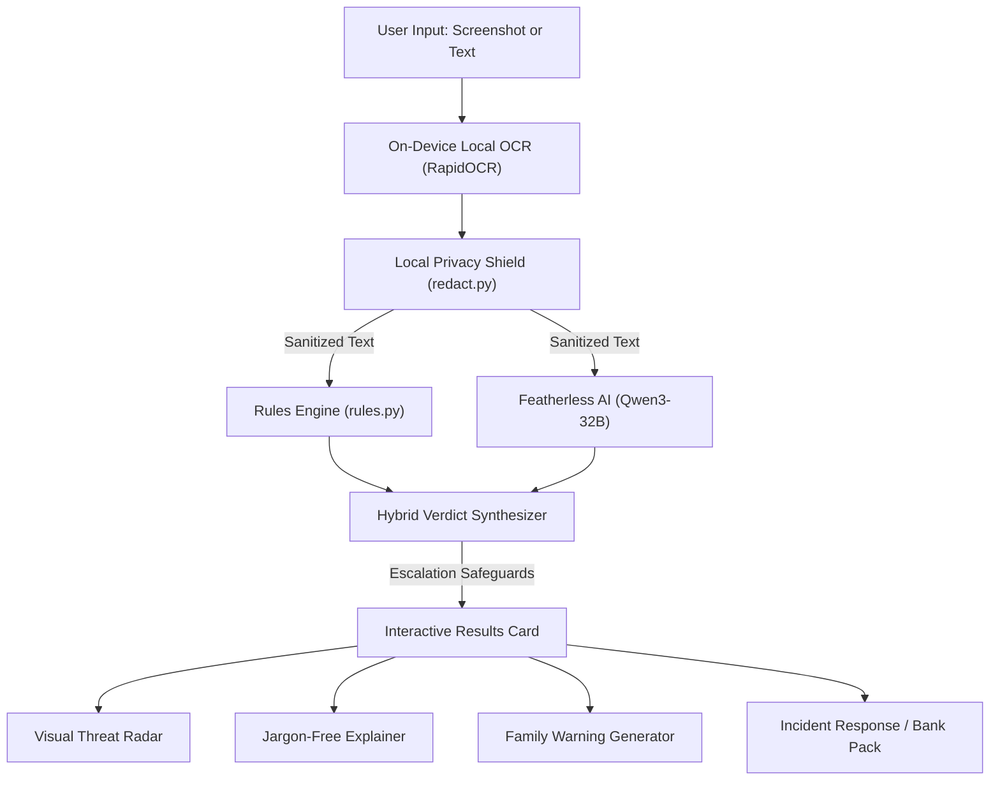

# 🔍 Second Look

> **ForgeHacks 2026 — AI + Cybersecurity Track**  
> An accessible, privacy-first scam detection & incident recovery platform for everyday people. Built for non-technical users, vulnerable seniors, and busy families before they click, pay, or reply.

---

## 💡 The Problem & Real-World Impact
Cybercriminals steal billions every year through phishing, impersonation, and fake delivery/banking texts. When everyday or non-technical people receive suspicious SMS, emails, or WhatsApp messages, they face two huge problems:
1. **Fear and uncertainty**: They don't know who to ask, or feel embarrassed.
2. **Post-incident panic**: If they already clicked or paid, they don't know the immediate defensive steps to take within the critical first hour.

**Second Look** gives users a secure "second opinion" on suspicious messages, explains tricky red flags in plain English, and provides structured recovery plans if they already took the bait.

---

## 🚀 Key Features

* **📸 On-Device Screenshot OCR**:
  - Non-technical users rarely copy-paste dangerous links. Users can simply upload a screenshot of any SMS, WhatsApp conversation, or email.
  - Text is extracted locally using `rapidocr-onnxruntime` — **the screenshot never touches the cloud or any external server**.
* **🛡️ Privacy Shield (`redact.py`)**:
  - Automatically sanitizes PII (Credit Cards with Luhn validation, IBANs, Bank Sort Codes & Account Numbers, Passcodes/OTPs, Phone Numbers, Emails, SSNs/National Insurance Numbers) using non-colliding sentinel tokens before calling AI models.
* **🧠 Hybrid Fail-Safe Intelligence (Rule Heuristics + LLM)**:
  - Powered by **Qwen3-32B via Featherless AI**.
  - **Defensive escalation**: Even if an LLM is tricked by persuasive text, rule-based heuristics (typosquatting, lookalike homoglyphs, URL shorteners, urgency triggers) automatically escalate the score to prevent dangerous false-negatives.
  - **Offline/Fail-Safe Fallback**: If network fails or API quotas run out, rule engines provide immediate standalone protection.
* **🏷️ Visual Threat Vector Radar**:
  - Displays instant badge pills highlighting active vectors: *Spoofed Brand*, *Hidden Link*, *Urgency Trigger*, *Financial Extortion*.
* **🚨 Victim Incident Response & One-Click Bank Log**:
  - Step-by-step interactive triage for users who already clicked, entered cards, or sent money.
  - Generates a downloadable **Formal Incident Action Log (`.txt`)** ready to hand to bank fraud departments or police (Action Fraud / 7726 / FTC).
* **👨‍👩‍👧 Family Warning Generator & Plain-English Explainer**:
  - Drafts custom warning messages for parents, grandparents, or group chats.
  - Explains technical risks in accessible, jargon-free words.
* **🎨 10 Accessible Modern Themes**:
  - Mathematically verified for WCAG AAA/AA contrast standards ($\ge 4.5:1$ text contrast, $\ge 3:1$ element visibility), complete with a **Larger Text & Buttons** switch for seniors.

---

## 🏗️ Architecture & Pipeline



---

## ⚡ Quickstart & Setup

### 1. Prerequisites
- Python 3.10+ (tested on Python 3.14)

### 2. Install Dependencies
```bash
git clone https://github.com/your-username/second-look.git
cd second-look
python -m venv .venv
# On Windows:
.venv\Scripts\activate
# On macOS/Linux:
source .venv/bin/activate

pip install -r requirements.txt
```

### 3. Environment Configuration
Create a `.env` file in the project root:
```env
FEATHERLESS_API_KEY="your-featherless-api-key"
FEATHERLESS_MODEL="Qwen/Qwen3-32B"
```
*(Note: If no API key is provided, the app automatically runs in rule-based fallback mode!)*

### 4. Run the Application
```bash
streamlit run app.py
```

### 5. Run the Test Suite
Second Look includes a comprehensive automated test suite with **358 passing tests**:
```bash
pytest
```

---

## 🏆 ForgeHacks 2026 Submission Summary

| Requirement | Details |
| :--- | :--- |
| **Track** | **AI + Cybersecurity** |
| **Target Users** | Everyday internet users, vulnerable seniors, non-technical families |
| **AI Technologies** | Qwen3-32B (via Featherless AI), Computer Vision OCR (`rapidocr-onnxruntime`) |
| **Defensive Security** | Prompt-injection stripping (`strip_tags`), PII redaction shield, fail-safe rule escalation, zero data retention |
| **Testing** | 358 unit and integration tests passing in ~3.6s |
